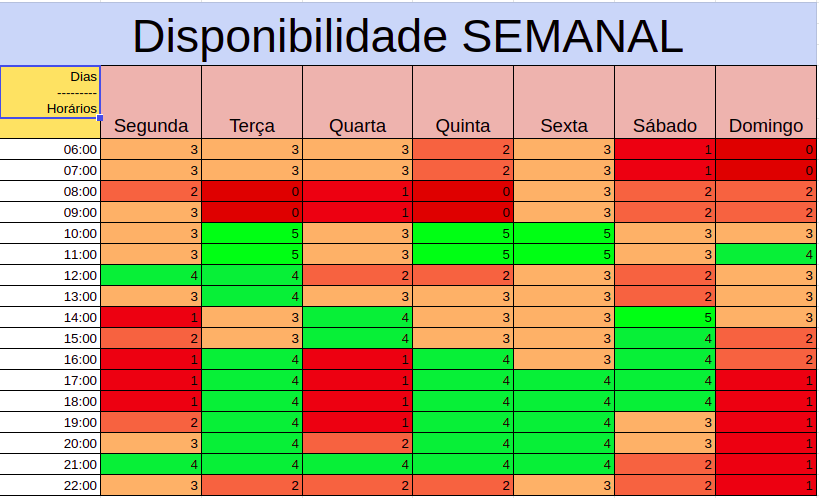

# Planejamento do Projeto

## Histórico de Versões

| Data       | Versão | Descrição                        | Autores                   | Revisor |
| ---------- | ------ | -------------------------------- | ------------------------- | ------- |
| 16/02/2021 | 0.1    | Criação da Wiki Planejamento     | Eduarda S. e Luis Gustavo | ------- |
| 25/02/2021 | 0.2    | Atualização da Wiki Planejamento | Todos os membros          | ------- |

## Justificativa de escolha do aplicativo

Em consenso, a equipe escolheu o app [Meu Gov.br](https://play.google.com/store/apps/details?id=br.gov.meugovbr&hl=pt_BR&gl=US) para a realização do projeto da matéria Requisitos de Software. Vimos, nele, potencial de melhora, como disponibilizar outros documentos oficiais além dos já encontrados na plataforma.

## Outros aplicativos analisados

-   [Carteira Digital de Trânsito](https://play.google.com/store/apps/details?id=br.gov.serpro.cnhe&hl=pt_BR&gl=US)
-   [Conecte SUS](https://play.google.com/store/apps/details?id=br.gov.datasus.cnsdigital&hl=pt_BR&gl=US)
-   [Hemovida](https://play.google.com/store/apps/details?id=br.gov.datasus.hemovida&hl=pt_BR)
-   [Vivabem](https://play.google.com/store/apps/details?id=br.gov.datasus.vivabem&hl=pt_BR)
-   [ENEM](https://play.google.com/store/apps/details?id=br.gov.inep.inepenem&hl=pt_BR&gl=US)

## Heatmap

Os 5 membros da equipe possuem disponibilidade nas Terças, Quintas e Sextas de 10h as 12h.

## Cronograma

| Entrega                         | Data de entrega esperada | Data de entrega limite |
| ------------------------------- | ------------------------ | ---------------------- |
| Planejamento                    | 17/02/2021               | 19/02/2021             |
| Elicitação                      | 05/03/2021               | 12/03/2021             |
| Modelagem de Requisitos (Ágil)  | 15/03/2021               | 22/03/2021             |
| Modelagem de Requisitos (Geral) | 25/03/2021               | 01/04/2021             |
| Análise de Requisitos           | 08/04/2021               | 15/04/2021             |
| Projeto Final                   | 26/04/2021               | 03/05/2021             |

Estipulamos uma dedicaçao semanal de 8 horas semanais por membro da equipe

## Ferramentas

| Ferramenta                                                                                                                                                                                                                    | Nome               | Descrição                                                |
| ----------------------------------------------------------------------------------------------------------------------------------------------------------------------------------------------------------------------------- | ------------------ | -------------------------------------------------------- |
|                                                                                                              | Google Suite       | Ferramenta usada para auxílio na criação dos slides      |
|  | Microsoft Office   | Ferramenta para criação de planilhas                     |
|  | Microsoft Teams    | Ferramenta usada para reuniões em equipe                 |
|                                                                                                        | Telegram           | Ferramenta usada para comunicação entre os membros       |
|                                                                                  | Visual Studio Code | Ferramenta de edição de códigos utilizada pela equipe    |
|                                                                                                                            | GitHub             | Ferramenta usada para armazenar os documentos do projeto |
|                                                                                                 | CorelDraw          | Ferramenta usada para elaborar o Rich Picture            |
|                                                                                                                       | Photoshop          | Ferramenta usada para criação dos slides finais          |
|                                                                                                                             | MKdocs             | Ferramenta usada para criação do Site wiki do projeto.   |

## Contribuições para a Primeira Apresentação

| Realização                              | Membro que contribuiu           |
| --------------------------------------- | ------------------------------- |
| Escolha do aplicativo                   | Todos os membros                |
| Escolha das ferramentas                 | Todos os membros                |
| Definição do cronograma                 | Todos os membros                |
| Rich Picture Inicial                    | Eduarda Servidio                |
| Conteúdo dos Slides da apresentação     | Todos os membros                |
| Design dos Slides                       | Eduarda Servidio                |
| Gravação do Video da Apresentação       | Todos os membros                |
| Edição do vídeo/Link da Apresentação    | Luis Gustavo                    |
| Inicio da organização do Git do projeto | Eduarda S., Giovana D., Luis G. |
