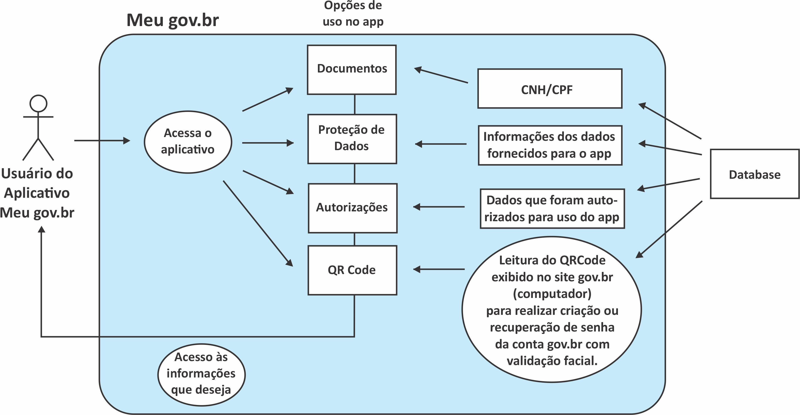

## Histórico de Versões

| Data       | Versão | Descrição       | Autores             | Revisor |
| ---------- | ------ | --------------- | ------------------- | ------- |
| 25/02/2021 | 0.1    | Criação da Aba Pre-Rastreabilidade, adição do Rich Picture, da introdução, das legendas e da bibliografia    | Eduarda Servidio    | Gabriela Pivetta |
| 28/02/2021 | 0.2    | Correção na ordem dos elementos da página | Gabriela Pivetta  | Eduarda Servidio |
| 02/03/2021 | 0.3    | Melhora do visual (justificação dos textos) | Eduarda Servidio    | Gabriela Pivetta |

## Introdução

O Rich Picture é o desenho de uma situação que ilustra os principais elementos e relações que precisam ser considerados a fim de criar alguma melhoria. É composto por imagens, textos, símbolos e ícones, todos usados ​​para ilustrar graficamente a situação.

## Rich Picture

## Referências Bibliográficas

Monk,A; Howard,S. The Rich Picture. A Tool for Reasoning About Work Context. Disponível em <a href="https://www.ics.uci.edu/~wscacchi/Software-Process/Readings/RichPicture.pdf">https://www.ics.uci.edu/~wscacchi/Software-Process/Readings/RichPicture.pdf</a>. Acesso em 16 de fev. de 2021.

WAGENINGEN University. Rich Picture. Disponível em <a href="http://www.mspguide.org/tool/rich-picture">http://www.mspguide.org/tool/rich-picture.</a> Acesso em 16 de fev. de 2021.

