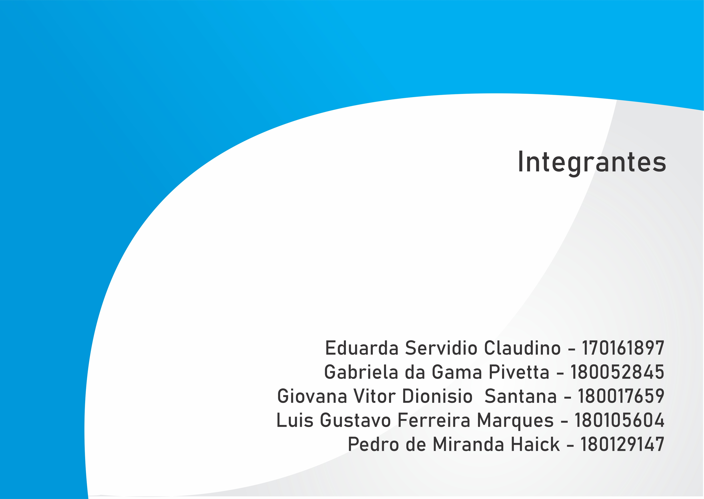

# Planejamento do Projeto

Realização: 11/02/2021 até 17/02/2021

Escolhemos o Aplicativo Meu Gov.br para realizar o projeto da matéria Requisitos de Software.

Foram desenvolvidos o Rich Picture inicial e a Wiki do Projeto.

# Apresentação

Link da apresentação:

<iframe width="820" height="500" src="https://www.youtube-nocookie.com/embed/IC_sE4dq9fA" frameborder="0"
    allow="accelerometer; autoplay; clipboard-write; encrypted-media; gyroscope; picture-in-picture"
    allowfullscreen></iframe>

Slides da apresentação:

## Contribuições da Equipe

| Realização                                         | Membro que contribuiu           |
| -------------------------------------------------- | ------------------------------- |
| Escolha do aplicativo                              | Todos os membros                |
| Escolha das ferramentas                            | Todos os membros                |
| Definição do cronograma                            | Todos os membros                |
| Rich Picture Inicial                               | Eduarda Servidio                |
| Conteúdo dos Slides da apresentação                | Todos os membros                |
| Design dos Slides                                  | Eduarda Servidio                |
| Inicio da organização do projeto(Git)              | Eduarda S., Giovana D., Luis G. |
| Inicio da Criação da Wiki                          | Eduarda S. e Luis Gustavo       |
| Gravação do Video da Apresentação                  | Todos os membros                |
| Edição do vídeo/Link da Apresentação               | Luis Gustavo                    |
| Adição de moldura do vide e slides de apresentação | Luis Gustavo                    |
